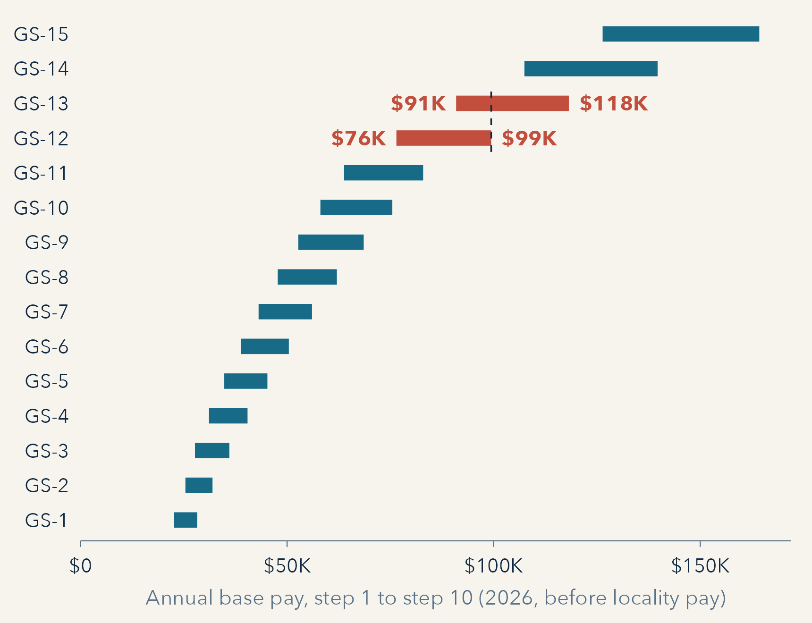

## Outline {.title-slide data-background-color="#102a43"}

::: {.hero-statement}
- Designing jobs
- Job analysis
- Classification and job evaluation
- Emotional labor and equity
- Case study: Job Evaluation (after the break)
:::

## Designing Jobs {.section-slide data-background-color="#102a43"}

## Answering 911

::: {.compare .jd .roomy .jd-911}
<div class="compare-side"><span class="card-heading">SOC definition</span>

[43-5031 · Public Safety Telecommunicators]{.soc-code}

Operate telephone, radio, or other communication systems to receive and communicate requests for emergency assistance at 9-1-1 public safety answering points and emergency operations centers. Take information from the public and other sources regarding crimes, threats, disturbances, acts of terrorism, fires, medical emergencies, and other public safety matters. May coordinate and provide information to law enforcement and emergency response personnel. May access sensitive databases and other information sources as needed. May provide additional instructions to callers based on knowledge of and certification in law enforcement, fire, or emergency medical procedures.

</div>
<div class="compare-side"><span class="card-heading">SOC classification</span>

- Major group 43-0000, Office and Administrative Support Occupations, with 43-4171 Receptionists and Information Clerks and 43-4071 File Clerks
- Police and firefighters: major group 33-0000, Protective Service Occupations
- SOC Policy Committee, 2016, declining to move it: the work "is that of a dispatcher, not a first responder" (responses to comments on the 2018 SOC, BLS)

</div>
:::

::: {.question-bar .fragment}
Does it matter how a job is classified? Who is affected?
:::

## Answering 911: Background

::: {.jd-lead}
The 2018 SOC definition includes: "May provide additional instructions to callers based on knowledge of and certification in law enforcement, fire, or emergency medical procedures."
:::

::: {.timeline .jd-tl}
<div class="tl-step"><span class="tl-year">2016</span><span class="card-heading">SOC Policy Committee</span><p>Declines requests to move the occupation to Protective Service</p></div>
<div class="tl-step fragment"><span class="tl-year">2017</span><span class="card-heading">OMB final 2018 SOC</span><p>Keeps it in Office and Administrative Support; renames it from "Police, Fire, and Ambulance Dispatchers" to "Public Safety Telecommunicators"</p></div>
<div class="tl-step fragment"><span class="tl-year">2019–2025</span><span class="card-heading">House: 911 SAVES Act</span><p>Introduced in every Congress; has not passed</p></div>
<div class="tl-step fragment"><span class="tl-year">2024</span><span class="card-heading">2028 SOC revision</span><p>OMB requests comment, including on public safety telecommunicators; no proposal published yet</p></div>
<div class="tl-step fragment accent-step"><span class="tl-year">Sept. 2025</span><span class="card-heading">Senate: S. 725</span><p>Passes by unanimous consent; held at the House desk</p></div>
:::

::: {.jd-note .fragment}
States: 25 have reclassified telecommunicators by law or resolution (NCSL, cited by CRS). Idaho: an "emergency communications officer" is a first responder for psychological injury claims (Idaho Code § 72-451, 2019); H0499 (2022) gives them police officer member status in PERSI.
:::

::: {.source-line}
Sources: SOC Policy Committee responses to comments (BLS, 2016) · 82 FR 56271 (2017) · CRS IF12747 · congress.gov (H.R. 1629, 2351, 6319, 637; S. 725) · Idaho Code § 72-451; H0499 (2022)
:::

## The Cost of Poorly Designed Jobs

::: {.compare .jd .jd-two}
<div class="compare-side"><span class="card-heading">Practical</span>

Jobs tell us what needs to be done by whom in an organization and how tasks should be grouped together and directed toward organizational outcomes.

</div>
<div class="compare-side"><span class="card-heading">Symbolic</span>

In addition, jobs tell us about power, responsibility, knowledge, and professional identity.

</div>
:::

::: {.question-bar .fragment}
What is a job? What happens when we do not give careful attention to how jobs are designed?
:::

## Challenges of Job Design in Public Service

::: {.compare .jd .roomy .jd-cols}
<div class="compare-side"><span class="card-heading">Job-Based Approach to Job Design</span>

- Jobs adhere to the organization
- Tasks exist
- Group them together into a job
- If incumbent leaves, find someone to replace them to perform identical functions

</div>
<div class="compare-side"><span class="card-heading">Much public service work is messy</span>

- Knowledge work
- Collaboration and interdependence

</div>
<div class="compare-side accent"><span class="card-heading">Competency-based approach to designing jobs</span>

- More adaptable and holistic

</div>
:::

## KSAs and Competencies

```{=html}
<div class="ksa">
<div class="ksa-stack">
<div class="ksa-item"><p><strong>Knowledge:</strong> a body of information needed for a job</p></div>
<div class="ksa-item"><p><strong>Skill:</strong> the level of proficiency one possesses in executing tasks</p></div>
<div class="ksa-item"><p><strong>Abilities:</strong> the power to perform an activity or behavior required for a job</p></div>
<div class="ksa-item"><p><strong>Other characteristics (KSAOCs):</strong> allows for inclusion of other traits</p></div>
</div>
<div class="ksa-arrow fragment" data-fragment-index="1">→</div>
<div class="ksa-comp fragment" data-fragment-index="1"><span class="card-heading">Competency</span>
<p>An intertwined set of knowledge, skills, and behaviors that employees need to perform their job.</p>
<p>The ability to lead teams, for example, requires:</p>
<ul><li>interpersonal skills</li><li>knowledge of the work</li><li>performance management skills</li><li>leadership prowess</li></ul>
</div>
</div>
```

::: {.takeaway .fragment}
Proficiency in necessary competencies differentiates high performing employees from low-performing employees.
:::

## Talent Management and Position Management

::: {.compare .jd .roomy}
<div class="compare-side"><span class="card-heading">Talent management</span>

Talent management (or SHRM) is a big picture approach to understanding jobs and how they contribute to organizational performance.

</div>
<div class="compare-side"><span class="card-heading">Position management</span>

Position management involves the "nuts and bolts" activities of designing jobs and assigning work to different positions and units.

</div>
:::

::: {.takeaway .fragment}
Position management also builds predictability into the HR budget because it forecasts personnel costs.
:::

## Career Ladders

::: {.jd-lead}
A vertically linked series of positions within the same occupation. A career ladder is how employees advance through progressively higher positions, each of which brings more responsibility, autonomy, and salary. Meeting the minimum qualifications for the next higher position makes them eligible for advancement up the ladder.
:::

```{=html}
<div class="ladder">
<div class="rung r1"><span class="card-heading">GS-7</span></div>
<div class="rung r2 fragment"><span class="card-heading">GS-9</span></div>
<div class="rung r3 fragment"><span class="card-heading">GS-11</span></div>
<div class="rung r4 fragment"><span class="card-heading">GS-12</span><p>Full performance level</p></div>
</div>
```

::: {.jd-note}
An illustrative federal ladder for a program analyst position.
:::

::: {.question-bar .fragment}
Think through your career ladder: what would be the next steps to move up that ladder? What are the challenges with building career ladders in small governments and nonprofits?
:::

## Job Analysis {.section-slide data-background-color="#102a43"}

## Job Analysis

::: {.compare .jd .roomy .jd-cols}
<div class="compare-side"><span class="card-heading">Process of identifying everything a job entails</span>

- Duties and responsibilities
- KSAs required
- Working conditions
- Resources necessary to do the job

</div>
<div class="compare-side"><span class="card-heading">Start with the purpose of the job and think about</span>

- The work environment
- Reporting channels
- Connections to related jobs
- Level at which the job is performed
- Where (in what unit)
- Performance criteria

</div>
:::

## Job Analysis {#job-analysis-2}

::: {.jd-lead}
- Can be organized around tasks, activities, or duties
- Can lead to development of a competency model, including all the required competencies and the associated behaviors needed to achieve those competencies
- Job analysis forms the basis of many other HRM functions
:::

```{=html}
<div class="ja-hub">
<div class="ja-core">Job analysis</div>
<div class="ja-arrow">→</div>
<div class="ja-uses">
<div class="ja-use tonight fragment"><span class="card-heading">Job descriptions</span><p>Tonight</p></div>
<div class="ja-use tonight fragment"><span class="card-heading">Classification</span><p>Tonight</p></div>
<div class="ja-use fragment"><span class="card-heading">Recruitment and selection</span><p>October 5 · Chapter 6</p></div>
<div class="ja-use fragment"><span class="card-heading">Compensation</span><p>October 12 · Chapter 7</p></div>
<div class="ja-use fragment"><span class="card-heading">Training and development</span><p>October 19 · Chapter 8</p></div>
<div class="ja-use fragment"><span class="card-heading">Performance appraisal</span><p>October 19 · Chapter 9</p></div>
</div>
</div>
```

::: {.question-bar .fragment}
Why are job analyses useful for government and nonprofit organizations?
:::

## Doing a Job Analysis

::: {.jd-lead}
- No one "right way"
- Can be a desk audit of an existing job, design of a new one, or redesign of an existing one
- About understanding tasks and how they are done
:::

```{=html}
<div class="el-chips">
<span class="el-chip">Observations</span><span class="el-chip">Job diaries</span><span class="el-chip">Focus groups</span><span class="el-chip">Task inventories</span><span class="el-chip">Desk audits</span><span class="el-chip">Critical incident techniques</span><span class="el-chip">Interviews</span>
</div>
```

::: {.takeaway .fragment}
Weaknesses: when tasks are not pre-programmed; capturing the emotive component of public service work
:::

## Activity: Job Analysis {.activity-slide data-background-color="#176b87"}

::: {.activity-prompt}
Split into groups. Pick someone to interview about their job.
:::

- Using the handout, interview the group member with work experience about their job; learn the major duties of their position and competencies required.
- How well does what you found match the classmate's current job description?

::: {.activity-close}
Twelve minutes to interview, then two groups report.
:::

## Job Analysis Activity: Interview {.activity-slide data-background-color="#176b87"}

::: {.jd-questions}
1. What do you do? What activities do you perform on a daily basis? On a less-than-daily basis? (Try to group these together to pinpoint primary tasks.)
2. How do you do these activities? (Try to determine the physical, observational, and mental aspects of the tasks.)
3. What is the result or purpose of your work? (Find this out for each of the tasks identified.)
4. With whom do you come in contact when performing your job? What is the purpose of the contact? Or, what do you do during the contact? How long does it last? How often? (Relate these contacts to the tasks.)
5. What kinds of equipment or machines do you use in your work? What do you do with them?
6. What knowledge, skills, and abilities are required to do your job?
7. What policies and procedures do you follow in performing your job? Are there any other guidelines you use in your work? How does your supervisor assign work? How does your supervisor review the work you have done? Where do the things come from that you work on? What happens to things you work on after you finish?
:::

## Capturing the Dynamic Nature of Public Service Work: Job Descriptions

::: {.jd-lead}
- Public problems change and jobs must evolve to keep up with those changes
- The job description is a brief statement of what occurs in a job. It includes:
:::

::: {.four-corners .roomy-corners .jd-desc}
<div class="corner"><p>The important, regular, and recurring duties and responsibilities</p></div>
<div class="corner"><p>A statement of the kind of supervision and guidance that is received</p></div>
<div class="corner"><p>Specification of the knowledge, skills, abilities, and other characteristics required</p></div>
<div class="corner"><p>Minimum education requirements and/or certification(s)</p></div>
:::

::: {.jd-note}
Organizations can have long formal definitions within the internal job system and shorter paragraph-length job descriptions that are used to advertise positions and direct the applicant to the longer description.
:::

::: {.question-bar .fragment}
How many of the elements did your interviewee's job description include?
:::

## Classification and Job Evaluation {.section-slide data-background-color="#102a43"}

## Job Taxonomy

::: {.jd-lead}
Way of understanding jobs so they can be compared across organizations
:::

```{=html}
<div class="tax-head"><span>Level</span><span>Definition</span><span>Example</span></div>
<div class="tax">
<div class="tax-row t1"><span class="card-heading">Job family</span><p>A broad categorization of jobs with similar attributes within a taxonomy of jobs</p><p class="tax-eg">Healthcare Practitioners and Technical (O*NET)</p></div>
<div class="tax-row t2 fragment"><span class="card-heading">Occupational group</span><p>Job families are subdivided into a number of occupational groups</p><p class="tax-eg">0600 – Medical, Hospital, Dental, and Public Health Group (OPM)</p></div>
<div class="tax-row t3 fragment"><span class="card-heading">Job series</span><p>The subdivision of an occupational group into positions that are similar in terms of specialized work and qualification requirements</p><p class="tax-eg">0610 – Nursing Series (OPM)</p></div>
<div class="tax-row t4 fragment"><span class="card-heading">Position</span><p>The individual position</p><p class="tax-eg">A nurse position at the Boise VA Medical Center</p></div>
</div>
```

::: {.jd-note}
Occupation: a concept that explains a set of jobs to which a number of similar titles belong, such as social work.
:::

## What Is a Classification System? What Purpose Does It Serve?

::: {.jd-lead}
Job classification: a system for categorizing duties, responsibilities, tasks, and authority level of a job. Unlike a job description, it does not contain KSAs. It is used as a means for setting compensation and organizing work and responsibility.
:::

::: {.compare .jd .roomy .jd-quote}
<div class="compare-side"><span class="card-heading">5 U.S.C. § 5101</span>

In determining the rate of basic pay which an employee will receive, (A) the principle of equal pay for substantially equal work will be followed; and (B) variations in rates of basic pay paid to different employees will be in proportion to substantial differences in the difficulty, responsibility, and qualification requirements of the work performed and to the contributions of employees to efficiency and economy in the service.

</div>
<div class="compare-side"><span class="card-heading">Merit principle 3, 5 U.S.C. § 2301(b)(3)</span>

Equal pay should be provided for work of equal value, with appropriate consideration of both national and local rates paid by employers in the private sector, and appropriate incentives and recognition should be provided for excellence in performance.

</div>
:::

## Positives and Negatives of Classification Systems

::: {.question-bar}
What are the positives and negatives of classification systems?
:::

::: {.compare .jd .roomy .jd-cols .jd-pn}
<div class="compare-side fragment"><span class="card-heading">Positives</span>

- Equity in pay: similar pay for similar work
- Transparent, consistent rules
- Protection against favoritism
- Predictable personnel budgets

</div>
<div class="compare-side fragment"><span class="card-heading">Negatives</span>

- Rigid and slow to change as work changes
- Hard to compete for scarce skills
- Many narrow classes; titles drift from the actual work

</div>
:::

## Broadbanding: The China Lake Test

::: {.jd-lead}
In July 1980 the Navy replaced the General Schedule at two labs (China Lake and San Diego) with broad pay bands, simpler position classification, and closer links between performance and pay.
:::

::: {.compare .jd .roomy .jd-quote}
<div class="compare-side fragment"><span class="card-heading">GAO, 1988</span>

"The Project Is Workable but Its Outcomes Are Unclear." It was implemented "to the general satisfaction of many managers and employees," but "insufficient data were available to support a conclusion that the project had successfully met its objectives."

</div>
<div class="compare-side fragment"><span class="card-heading">Cost</span>

As of January 1986, salaries at the two labs were 6 percent higher than at comparison labs, about $16 million more.

</div>
:::

::: {.question-bar .fragment}
Would it be possible for an organization to have a fair and equitable pay scheme without basing it on job classifications and descriptions?
:::

::: {.jd-note}
Source: GAO/GGD-88-79 (1988). In 1994, Congress authorized similar projects at DoD science and technology labs (P.L. 103-337).
:::

## Classic Example: The General Schedule

```{=html}
<div class="gs-fig">
<div></div>
<div class="gs-side">
<div class="gs-fact"><strong>15 grades, 10 steps.</strong></div>
<div class="gs-fact fragment"><strong>Step increases.</strong> After 52, 104, or 156 weeks, if "the work of the employee is of an acceptable level of competence" (5 U.S.C. § 5335).</div>
<div class="gs-fact fragment"><strong>Grades overlap.</strong> GS-12 step 10 ($99,404) is more than GS-13 step 1 ($90,925).</div>
<div class="gs-fact fragment"><strong>Locality pay.</strong> Boise is in the Rest of U.S. area: 17.06% in 2026.</div>
</div>
</div>
```

## What Is Involved in Job Evaluation?

::: {.jd-lead}
Job evaluation: a process for objectively valuing each job element. Evaluations consist of assigning points to job elements according to their importance.
:::

```{=html}
<div class="pts-label"><p>Federal Factor Evaluation System: the nine factors</p></div>
<div class="mp-grid fes-grid fes-names">
<div class="mp"><span class="mp-label">Factor 1, Knowledge Required by the Position</span></div>
<div class="mp"><span class="mp-label">Factor 2, Supervisory Controls</span></div>
<div class="mp"><span class="mp-label">Factor 3, Guidelines</span></div>
<div class="mp"><span class="mp-label">Factor 4, Complexity</span></div>
<div class="mp"><span class="mp-label">Factor 5, Scope and Effect</span></div>
<div class="mp"><span class="mp-label">Factor 6, Personal Contacts</span></div>
<div class="mp"><span class="mp-label">Factor 7, Purpose of Contacts</span></div>
<div class="mp"><span class="mp-label">Factor 8, Physical Demands</span></div>
<div class="mp"><span class="mp-label">Factor 9, Work Environment</span></div>
</div>
<div class="pts-label"><p>Master grade conversion table (total points)</p></div>
<div class="pts-strip"><div class="pts"><strong>GS-5</strong><span>855–1,100 points</span></div><div class="pts"><strong>GS-9</strong><span>1,855–2,100 points</span></div><div class="pts"><strong>GS-12</strong><span>2,755–3,150 points</span></div></div>
```

::: {.jd-note}
Idaho Code § 67-5309B(1): the administrator "shall establish benchmark job classifications and shall assign all classifications to a pay grade utilizing the Hay profile method in combination with market data."
:::

::: {.question-bar .fragment}
Where would the demands of a 911 call-taker's job be counted in these nine factors?
:::

## Emotional Labor and Equity {.section-slide data-background-color="#102a43"}

## 21st Century Jobs

::: {.three-words .jd-21c}
<div class="word-block"><span class="card-heading">The importance of emotional labor as a job requirement</span>

- What is emotional labor
- Jobs with significant emotive demands

</div>
<div class="word-block"><span class="card-heading">What jobs communicate</span>

- Requirements
- Performance expectations
- Role of the position in the organization

</div>
<div class="word-block"><span class="card-heading">Redesigning jobs to keep up with the times</span>

- Key considerations

</div>
:::

::: {.jd-note}
Hochschild, *The Managed Heart* (1983) · Guy, Newman, and Mastracci, *Emotional Labor: Putting the Service in Public Service* (2008)
:::

::: {.question-bar .fragment}
Identify jobs that require significant emotional labor. Do position descriptions address this well (or at all)? Are emotional labor competencies mentioned in job ads?
:::

## Jobs and Equity

::: {.jd-lead}
- Many ways to foster equity or inequities in the job design and classification process
- Example: pay equity
:::

::: {.compare .jd .roomy .jd-quote}
<div class="compare-side"><span class="card-heading">Equal Pay Act of 1963, 29 U.S.C. § 206(d)(1)</span>

"…for equal work on jobs the performance of which requires equal skill, effort, and responsibility, and which are performed under similar working conditions…"

</div>
<div class="compare-side"><span class="card-heading">Comparable worth, *AFSCME v. Washington* (9th Cir. 1985)</span>

"The comparable worth theory … postulates that sex-based wage discrimination exists if employees in job classifications occupied primarily by women are paid less than employees in job classifications filled primarily by men, if the jobs are of equal value to the employer, though otherwise dissimilar."

</div>
:::

::: {.jd-note}
Washington's 1974 study "found a wage disparity of about twenty percent, to the disadvantage of employees in jobs held mostly by women, for jobs considered of comparable worth." The district court ruled for AFSCME (1983); the Ninth Circuit reversed (1985): "Neither law nor logic deems the free market system a suspect enterprise." The state settled in 1985–86 (about $482 million in pay-equity raises).
:::

## Next Week…

**October 5: Recruitment and selection**

Guy & Sowa, Chapter 6

**Case:** Hiring SDS (student-led)

**Due October 12:** final paper proposal

## Case Study: Job Evaluation: Some Counselors Are More Equal Than Others {.section-slide data-background-color="#102a43"}
