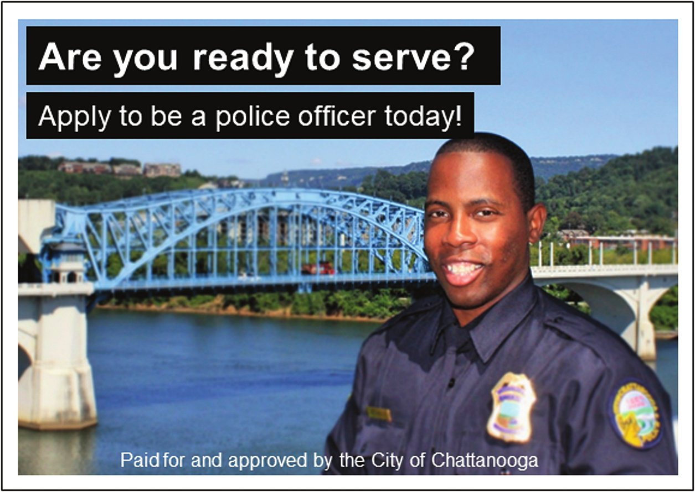
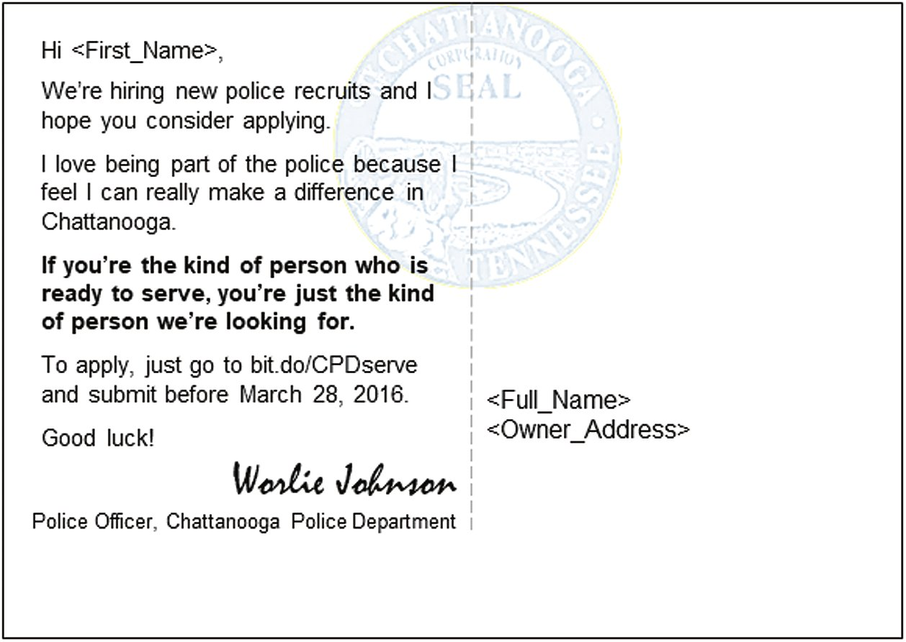
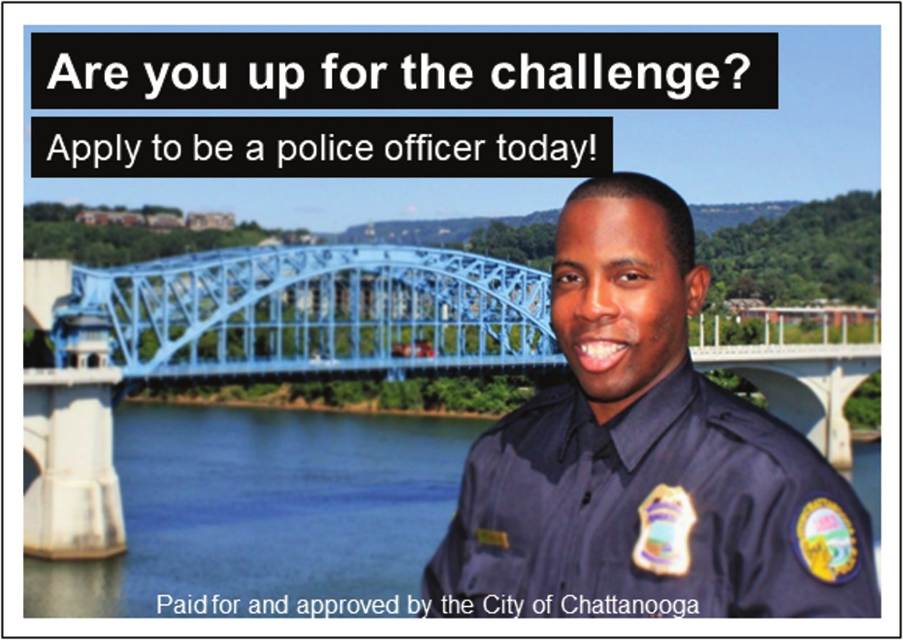
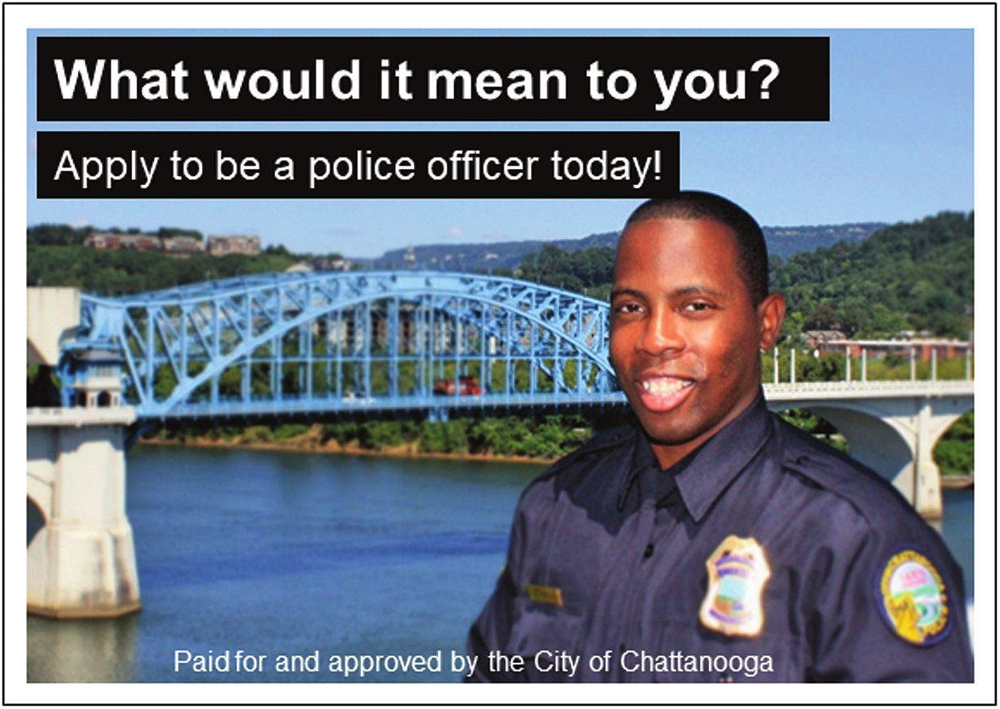
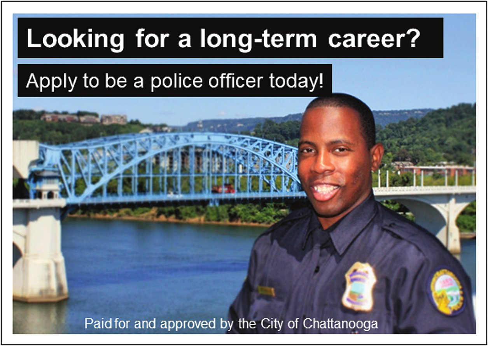

## Outline {.title-slide data-background-color="#102a43"}

::: {.hero-statement}
- Recruiting in public service
- Recruitment: getting started
- Selection
- Federal hiring now
- Case study: Hiring a Sustainable Development Specialist (after the break)
:::

## Recruiting in Public Service {.section-slide data-background-color="#102a43"}

## The Postcard

::: {.jd-lead}
Chattanooga Police Department, spring 2016. 9,907 postcards to registered voters in the county, each addressed by first name: the same officer's photo on the front, his signed message on the back. This is one of four versions.
:::

```{=html}
<div class="rs-pc-pair">
<figure class="rs-pc"><div class="rs-pc-frame"><span class="rs-hl fragment" data-fragment-index="1" style="left:3.2%;top:4.5%;width:69.3%;height:13.5%"></span></div><figcaption>Front</figcaption></figure>
<figure class="rs-pc"><div class="rs-pc-frame"><span class="rs-hl fragment" data-fragment-index="1" style="left:2.8%;top:22.1%;width:49.6%;height:14.6%"></span><span class="rs-hl fragment" data-fragment-index="1" style="left:2.8%;top:37.9%;width:49.6%;height:14.8%"></span></div><figcaption>Back</figcaption></figure>
</div>
```

::: {.takeaway .fragment fragment-index=1}
The experiment varied only the boxed parts: the tagline and two sentences.
:::

## Four Postcards, One Police Department

::: {.jd-lead}
Same photo, same officer, same signature. Each version's tagline and its two sentences:
:::

```{=html}
<div class="rs-cards rs-pcs">
<div class="rs-card"><span class="rs-tag">Serve</span>
<p>“I love being part of the police because I feel I can really make a difference in Chattanooga.”</p>
<p class="rs-line2">“If you’re the kind of person who is ready to serve, you’re just the kind of person we’re looking for.”</p></div>
<div class="rs-card"><span class="rs-tag">Challenge</span>
<p>“I love being part of the police because you never know what to expect: it’s challenging but rewarding work!”</p>
<p class="rs-line2">“If you’re the kind of person who thrives in challenging environments, you’re just the kind of person we’re looking for.”</p></div>
<div class="rs-card"><span class="rs-tag">Impact</span>
<p>“I love being part of the police because I feel I can really make a difference in Chattanooga.”</p>
<p class="rs-line2">“Just think what it would mean to you and your community if you became a police officer.”</p></div>
<div class="rs-card"><span class="rs-tag">Career</span>
<p>“I love being part of the police because I’m constantly developing my skills: this isn’t just a job, it’s a career.”</p>
<p class="rs-line2">“If you’re looking for a long-term career, you’re just the kind of person we’re looking for.”</p></div>
</div>
```

::: {.question-bar .fragment}
Which postcard brought in the most applicants?
:::

## What Chattanooga Found

```{=html}
<div class="rs-cards rs-reveal rs-pcs">
<div class="rs-card flat"><span class="rs-tag">Serve</span></div>
<div class="rs-card win"><span class="rs-tag">Challenge</span></div>
<div class="rs-card flat"><span class="rs-tag">Impact</span></div>
<div class="rs-card win"><span class="rs-tag">Career</span></div>
</div>
```

::: {.stat-row .rs-stats style="margin-top:.6em"}
<div class="stat"><span class="stat-number">0.2%</span><p>Application rate with no postcard</p></div>
<div class="stat fragment" data-fragment-index="1"><span class="rs-go fragment" data-fragment-index="1"></span><span class="stat-number">0.6%</span><p>Challenge and Career postcards: three times as effective, "without an observable loss in applicant quality"</p></div>
<div class="stat fragment" data-fragment-index="2"><span class="stat-number">No different</span><p>Serve and Impact postcards, compared with no postcard at all</p></div>
:::

::: {.jd-note .fragment fragment-index=3}
"For applicants of color and women, the messages focusing on both the challenge and job security were disproportionately impactful." Before the round, the force was 78% white and 93% male; the city was 56% white and 35% black.
:::

::: {.source-line}
Linos, E. (2018). More than public service: A field experiment on job advertisements and diversity in the police. *JPART*, 28(1), 67–85.
:::

## Who Wants a Government Job?

::: {.compare .jd .roomy .rs-quote}
<div class="compare-side"><span class="card-heading">Linos (2018)</span>

"The number of people interested in government jobs has steadily declined in the past two decades, even among public affairs graduates."

</div>
<div class="compare-side"><span class="card-heading">Fowler and Birdsall (2020)</span>

"Findings suggest that the best and brightest law school graduates are predisposed to employment in the private or nonprofit sectors because they offer the strongest extrinsic or intrinsic incentives."

</div>
:::

::: {.question-bar .fragment}
Why are you in public service? What would a recruiter need to know about you?
:::

::: {.source-line}
Fowler, L., & Birdsall, C. (2020). Are the best and brightest joining the public service? *Review of Public Personnel Administration*, 40(3), 532–554.
:::

## Effective Recruitment and Selection

::: {.jd-lead}
- A certain amount of turnover happens in organizations
  - Understanding good versus problematic turnover
- Managers need employees with the right knowledge, skills, and abilities
- Employees want to be valued, developed, and rewarded and they want a place where they fit
- Managers cannot be certain they made a good hire until the person is on the job for a while, but experience helps improve the probability
:::

::: {.takeaway .fragment}
Person–organization fit: congruence or alignment between an individual and an organization. Their personal values, goals, and ethics align with those of the organization.
:::

## Recruitment: Getting Started {.section-slide data-background-color="#102a43"}

## Key Questions

::: {.rs-lead-q}
To start: what are we hiring for?
:::

::: {.jd-lead}
- Is this a new position or previously filled?
- If it was previously filled, at what level? Should that level remain the same?
- If it is a new position, was a job analysis conducted to ensure the correct qualifications are known?
:::

::: {.question-bar .fragment}
What else? What are other questions to ask when getting started?
:::

## Who Does the Recruiting and From Where?

::: {.compare .jd .roomy .jd-cols}
<div class="compare-side"><span class="card-heading">Who does the recruiting?</span>

- Centralized
- Decentralized
- Combination
- Outsourced

</div>
<div class="compare-side"><span class="card-heading">From where should we hire?</span>

- Internal
- External

</div>
:::

::: {.question-bar .fragment}
What are the benefits of decentralized recruitment? What are the costs?
:::

::: {.jd-note .fragment}
Peter Principle: individuals in organizations will be promoted up a hierarchy until they reach their level of incompetence. Just because someone is good at one job does not mean they will be good at another.
:::

## Recruitment Strategies

::: {.jd-lead}
- Strategies range from passive to active
- Think about the position being filled and which strategies will lead to the deepest and most diverse pool of candidates
:::

::: {.rs-lead-q}
What are some considerations?
:::

```{=html}
<div class="el-chips rs-chips">
<span class="el-chip">Image of your organization</span><span class="el-chip">Labor market/labor pool</span><span class="el-chip">Current composition of current workforce</span><span class="el-chip">Nature of the position</span>
</div>
```

::: {.question-bar .fragment}
Let's think about different strategies and how passive or active they are.
:::

## Activity: Recruiting for Public Service in Practice {.activity-slide data-background-color="#176b87"}

::: {.activity-prompt}
Think about what kind of information you look for in a job ad. Then review some government and nonprofit job ads and discuss how well they cover that information.
:::

- Federal: search for a position at usajobs.gov. What was your searching process like? What is involved in applying?
- Nonprofit: search for a position at idealist.org. What is involved in the application process?
- Compare: what does each ad tell you about the organization's values?

::: {.activity-close}
In groups, about ten minutes, then share what you found.
:::

## Recruitment Videos

::: {.jd-lead}
Maryland Department of General Services ([open on YouTube](https://www.youtube.com/watch?v=wdM8AFBfkyE))
:::

```{=html}
<div class="rs-video"><iframe data-yt="wdM8AFBfkyE" title="Maryland Department of General Services Recruitment Video" allow="accelerometer; clipboard-write; encrypted-media; gyroscope; picture-in-picture; web-share" referrerpolicy="strict-origin-when-cross-origin" allowfullscreen></iframe></div>
<script>
// Set the YouTube URL at runtime so embed-resources doesn't inline the page; reveal.js lazy-loads data-src when the slide is shown
document.querySelectorAll('iframe[data-yt]').forEach(f => f.setAttribute('data-src', 'https://www.youtube-nocookie.com/embed/' + f.dataset.yt + '?rel=0'));
</script>
```

::: {.question-bar}
What values are expressed, and what kind of information is provided? Is the video likely to be effective at recruiting job applicants? Why or why not?
:::

## Dot Your I's

::: {.lens-list}
<div class="lens"><span class="lens-num">1</span><p>Check your application process for unnecessary administrative hurdles and ease of use</p></div>
<div class="lens"><span class="lens-num">2</span><p>Ensure compliance with employment laws (e.g. Americans with Disabilities Act)</p></div>
<div class="lens"><span class="lens-num">3</span><p>After-action reporting on searches: review metrics and think about where process could be improved</p></div>
:::

::: {.question-bar .fragment}
What constitutes successful recruitment?
:::

## Selection {.section-slide data-background-color="#102a43"}

## Selection

::: {.jd-lead}
Once you have a deep and diverse candidate pool, the time has come to narrow down the pool and make a choice
:::

::: {.compare .jd .roomy .jd-cols}
<div class="compare-side"><span class="card-heading">Screen for minimum requirements</span>

- Be consistent: keep the focus on the standard of job-relatedness

</div>
<div class="compare-side accent"><span class="card-heading">Review your selection procedures</span>

- Need to comply with the Uniform Guidelines on Employee Selection Procedures
- Make sure there is not disparate impact

</div>
:::

## Griggs v. Duke Power Co. (1971)

::: {.jd-lead}
Duke Power required a high school education and satisfactory scores on two professionally prepared aptitude tests for placement in any department but Labor.
:::

::: {.compare .jd .roomy .rs-quote}
<div class="compare-side"><span class="card-heading">Chief Justice Burger, for the Court</span>

"The Act proscribes not only overt discrimination but also practices that are fair in form, but discriminatory in operation. The touchstone is business necessity. If an employment practice which operates to exclude Negroes cannot be shown to be related to job performance, the practice is prohibited."

</div>
:::

::: {.jd-note}
Griggs v. Duke Power Co., 401 U.S. 424, 431 (1971). Decided 8–0. The case solidifies the standard of job-relatedness.
:::

## The Uniform Guidelines (1978): The Four-Fifths Rule

::: {.compare .jd .roomy .rs-quote}
<div class="compare-side"><span class="card-heading">29 CFR § 1607.4(D)</span>

"A selection rate for any race, sex, or ethnic group which is less than four-fifths (4/5) (or eighty percent) of the rate for the group with the highest rate will generally be regarded by the Federal enforcement agencies as evidence of adverse impact…"

</div>
:::

::: {.rs-ff}
<div class="stat fragment"><span class="stat-number">48 of 80</span><p>Group A passes the written test: a 60% selection rate</p></div>
<div class="stat fragment"><span class="stat-number">12 of 40</span><p>Group B passes: a 30% selection rate</p></div>
<div class="stat rs-ratio fragment"><span class="stat-number">0.30 ÷ 0.60 = 0.50</span><p>Below 0.80: evidence of adverse impact</p></div>
:::

::: {.jd-note}
An illustrative example.
:::

::: {.rs-status .fragment}
**Where it stands in 2026.** The rule is still in the regulations, and Title VII still prohibits disparate impact (42 U.S.C. § 2000e-2(k)). But the EEOC stopped bringing disparate-impact-only cases in 2025, the Justice Department's Office of Legal Counsel called the Uniform Guidelines unconstitutional (June 9, 2026), and OPM removed them from federal personnel rules (July 31, 2026).
:::

::: {.source-line}
29 CFR § 1607.4(D) · EO 14281 (Apr. 23, 2025) · OLC, "Constitutionality of Disparate-Impact Liability Under Title VII" (June 9, 2026) · OPM interim final rule (July 31, 2026)
:::

## What Counts as an Employment Test?

::: {.compare .jd .roomy .rs-quote}
<div class="compare-side accent"><span class="card-heading">Uniform Guidelines, 29 CFR § 1607.16(Q)</span>

Selection procedure: "Any measure, combination of measures, or procedure used as a basis for any employment decision."

Any mechanism used to screen a potential employee is considered a test and therefore must meet the standards of validity and reliability.

</div>
<div class="compare-side"><span class="card-heading">SHRM</span>

"Standardized devices designed to measure skills, intellect, personality or other characteristics, and they yield a score, rating, description or category."

</div>
:::

::: {.question-bar .fragment}
By the legal definition, is a job interview a test? A resume screen?
:::

## Tests

::: {.compare .jd .roomy .jd-cols}
<div class="compare-side"><span class="card-heading">Different types of employment tests</span>

- Written exams (e.g., civil service exam)
- Performance tests
- Fitness tests

</div>
<div class="compare-side"><span class="card-heading">What tests are appropriate for the positions being filled?</span>

- Have you ever taken an employment test?
- Did you think it was fair?

</div>
:::

::: {.takeaway .fragment}
KEY: Must be VALID and RELIABLE. What does this mean?
:::

## Reliability and Validity

::: {.four-corners .roomy-corners .rs-val}
<div class="corner"><span class="card-heading">Reliability</span><p>Selection methods produce consistent results and do not vary significantly based on time, place, or person.</p></div>
<div class="corner fragment"><span class="card-heading">Content validity</span><p>Content is representative of performance on the job. A data entry speed and accuracy test, for a data entry job.</p></div>
<div class="corner fragment"><span class="card-heading">Criterion validity</span><p>A good predictor of desired future performance. Have incumbent employees take the test to see how well it correlates with their job performance.</p></div>
<div class="corner fragment"><span class="card-heading">Construct validity</span><p>Accurately measures concepts deemed important for job performance. A test of leadership skills has to measure those skills.</p></div>
:::

::: {.takeaway .fragment}
Reliability is a necessary but not sufficient condition for validity.
:::

## Interviews

::: {.jd-lead}
Should be structured to make sure candidates are treated equally
:::

::: {.three-words .rs-int}
<div class="word-block"><span class="card-heading">Structure</span>

Structured interview protocols improve validity and reduce bias

</div>
<div class="word-block"><span class="card-heading">Panel</span>

A panel of reviewers, when possible, can improve interview effectiveness

</div>
<div class="word-block"><span class="card-heading">Training</span>

Train people on effective interviewing

</div>
:::

::: {.question-bar .fragment}
What are some ways to reduce bias and improve the efficacy of interviews as a selection method?
:::

## Interviews: What To Do and Not To Do

::: {.compare .jd .roomy .jd-cols}
<div class="compare-side"><span class="card-heading">Effective interview questions</span>

- What is your experience with interviews? (as the potential employee or the one doing the hiring)
- What questions are particularly effective?

</div>
<div class="compare-side accent"><span class="card-heading">What not to ask</span>

- Illegal
- Inappropriate

</div>
:::

::: {.jd-note .fragment}
Situational question: the applicant must think about how they would handle a hypothetical scenario. Behavioral question: the applicant describes how they handled a past situation.
:::

## Assessment Centers

::: {.compare .jd .roomy .jd-cols}
<div class="compare-side"><span class="card-heading">Often use a combination of techniques</span>

- Interviews
- Performance tests
- Writing samples

</div>
<div class="compare-side"><span class="card-heading">Trade-offs</span>

- Can be very effective but require a significant investment of resources
- Often used for promotion activities (e.g. promotion to a management position)

</div>
:::

::: {.question-bar .fragment}
Do any of you have experience with an assessment center? Can you find examples where these are used in government or nonprofits near you?
:::

## True or False? {.activity-slide data-background-color="#176b87"}

::: {.rs-tf}
<div class="poll-item"><p>Employers are prohibited from asking if an applicant is legally permitted to work in the United States.</p><span class="poll-answer fragment">False</span></div>
<div class="poll-item"><p>Pre-employment drug tests are not considered medical examinations under the law.</p><span class="poll-answer fragment">True</span></div>
<div class="poll-item"><p>Ban the Box laws prohibit employers from checking the criminal record of new hires.</p><span class="poll-answer fragment">False</span></div>
<div class="poll-item"><p>Physical fitness tests are illegal under the Uniform Guidelines on Employee Selection Procedures.</p><span class="poll-answer fragment">False</span></div>
:::

## Federal Hiring Now {.section-slide data-background-color="#102a43"}

## Russell Vought, OMB Director

```{=html}
<div class="rs-vought">
<figure class="rs-vought-photo"><figcaption>Director, Office of Management and Budget (2020–21; 2025–)</figcaption></figure>
<div class="rs-vought-quote">
<p>“OMB has the statutory tools of a president to control the bureaucracy. … In the second term, he aims to really use OMB to go after the administrative state.”</p>
<p>“I think the realization that these were bureaucracies that were very hardened, very unaccountable, viewed themselves as very independent of the president, and that needed a macro approach—unified, comprehensive—to be able to ensure that <strong>the president was going to truly be in charge on the basis of democratic representation and not have career bureaucrats running these agencies.</strong> And I think developing that viewpoint out and that realization was something that was different from first to second.”</p>
</div>
</div>
```

::: {.question-bar .fragment}
Bureaucracy and democracy: where does this put the balance?
:::

::: {.source-line}
Russ Vought on the Claremont Institute's *The American Mind* podcast, as transcribed by RealClearPolitics, Sept. 24, 2026 (emphasis added). Photo: OMB official portrait (2025), public domain.
:::

## Federal Hiring Reform, 2020–2026

```{=html}
<div class="rs-tracks">
<div class="rs-track-label"><span class="card-heading">Skills-based hiring</span><p>Bipartisan, across administrations</p></div>
<div class="tl-step"><span class="tl-year">2020 · Trump</span><span class="card-heading">EO 13932</span><p>Judge applicants on job-related skills, not degrees</p></div>
<div class="tl-step"><span class="tl-year">Dec. 2024 · Biden</span><span class="card-heading">Chance to Compete Act</span><p>Technical assessments: position-specific, based on a job analysis, not self-ratings</p></div>
<div class="rs-hub"><span class="tl-year">May 29, 2025 · Trump</span><span class="card-heading">Merit Hiring Plan</span>
<div class="rs-hub-half"><p>Self-ratings out for ranking; every hire needs a technical or alternative assessment</p></div></div>
<div class="tl-step"><span class="tl-year">July 2026</span><span class="card-heading">OPM plan to Congress</span><p>Self-ratings gone above GS-04; time-to-hire from 101 days (FY&nbsp;2024) to 80</p></div>
<div class="tl-step"><span class="tl-year">FY 2028 target</span><span class="card-heading">100% of positions</span><p>So far: 34% of announcements (FY&nbsp;2026&nbsp;Q2)</p></div>
<div class="rs-track-label rs-pol fragment" data-fragment-index="1"><span class="card-heading">Presidential control</span><p>This administration</p></div>
<div class="rs-blank"></div>
<div class="tl-step rs-pol fragment" data-fragment-index="1"><span class="tl-year">Jan. 2025 · Trump</span><span class="card-heading">EO 14170</span><p>Hire for “merit, practical skill, and dedication to our Constitution”</p></div>
<div class="rs-hub rs-hub-bottom fragment" data-fragment-index="1"><div class="rs-hub-half rs-hub-pol"><p>Four essays on GS-05+ postings; political leadership approves hires and may hold an “executive interview”</p></div></div>
<div class="tl-step rs-pol fragment" data-fragment-index="1"><span class="tl-year">Nov. 2025</span><span class="card-heading">Unions sue</span><p><em>AFGE v. Kupor</em> (D.&nbsp;Mass.)</p></div>
<div class="tl-step accent-step rs-pol fragment" data-fragment-index="1"><span class="tl-year">Sept. 2026</span><span class="card-heading">Question 3 stayed, revised</span><p>Court stays it Sept.&nbsp;11; OPM replaces it Sept.&nbsp;19</p></div>
</div>
```

::: {.takeaway .fragment fragment-index=2}
The same memo that ends self-ratings also adds the four essays.
:::

::: {.source-line}
Sources: EO 13932 (2020) · P.L. 118-188 (2024) · EO 14170 (2025) · OPM and Domestic Policy Council, Merit Hiring Plan (May 29, 2025) · OPM, Chance to Compete Act implementation plan (July 2026) · OPM bulletin, Sept. 18, 2026
:::

## The Four Essay Questions (2025)

::: {.four-corners .rs-essays}
<div class="corner"><span class="card-heading">1. The Constitution</span><p>"How has your commitment to the Constitution and the founding principles of the United States inspired you to pursue this role within the Federal government? Provide a concrete example from professional, academic, or personal experience."</p></div>
<div class="corner"><span class="card-heading">2. Efficiency</span><p>"In this role, how would you use your skills and experience to improve government efficiency and effectiveness? Provide specific examples where you improved processes, reduced costs, or improved outcomes."</p></div>
<div class="corner"><span class="card-heading">3. Executive Orders</span><p>"How would you help advance the President's Executive Orders and policy priorities in this role? …"</p></div>
<div class="corner"><span class="card-heading">4. Work ethic</span><p>"How has a strong work ethic contributed to your professional, academic or personal achievements? Provide one or two specific examples, and explain how those qualities would enable you to serve effectively in this position."</p></div>
:::

::: {.jd-note}
200 words per question.
:::

## Question 3, Stayed and Revised

::: {.compare .jd .roomy .rs-quote}
<div class="compare-side"><span class="card-heading">Original (2025)</span>

"How would you help advance the President's Executive Orders and policy priorities in this role? Identify one or two relevant Executive Orders or policy initiatives that are significant to you, and explain how you would help implement them if hired."

</div>
<div class="compare-side accent fragment"><span class="card-heading">Revised (Sept. 19, 2026)</span>

"In this role, you will be expected to professionally and efficiently implement executive direction. Provide an example where you implemented leadership direction on a strategy or policy decision that differed from your own recommendation."

</div>
:::

::: {.question-bar .fragment}
How are employment tests or assessments evaluated to determine whether they are legal and appropriate to use?
:::

## Bringing It Together

::: {.jd-lead}
- Careful attention to recruitment and selection will lead to better hires
  - The right people with the right skills
  - Good person-organization fit
- Not one best way to do this: need to understand what you need and the factors shaping the decision
  - Job · Temporal and local conditions · Current workforce
- Need to ensure that you follow the law and promote public service values
  - Job-relatedness · Disparate impact
:::

::: {.takeaway .fragment}
Best measure of effective recruitment and selection is satisfied, productive employees
:::

## Next Week…

**October 12: Compensation and benefits**

Guy & Sowa, Chapter 7

**Case:** Paying the Tucson Police (student-led)

**Due October 12:** final paper proposal, in Canvas by class time. We will workshop proposals in class.

## Case Study: Hiring a Sustainable Development Specialist {.section-slide data-background-color="#102a43"}
