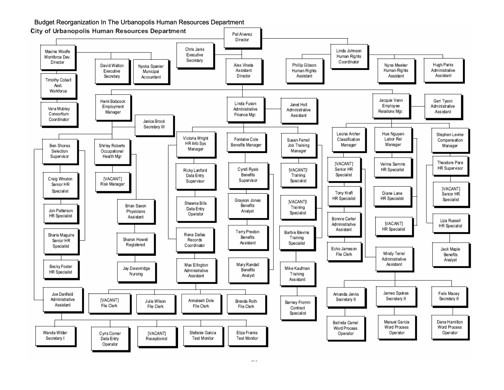
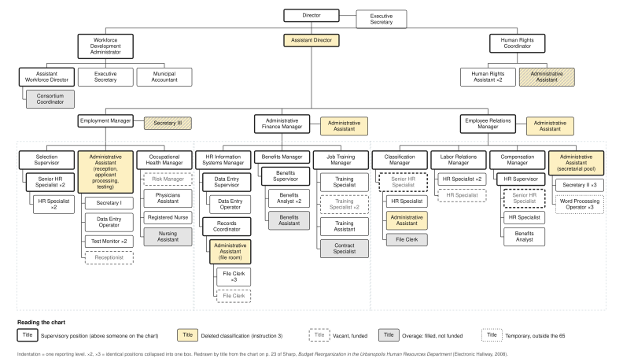

## Pat Alvarez's decision

You are the new HR director in a growing city of more than one million residents.

You must propose a smaller HR budget and a reorganization while developing the city's reduction-in-force policy.

::: {.takeaway}
How should HR preserve the capacity to serve the city under these constraints?
:::

## The budget target

::: {.table-block .figures}

| Current budget | Proposed budget | Required reduction |
|---:|---:|---:|
| $2,698,150 | $2,468,807 | $229,343 |

:::

- An **8.5% cut** in a budget that is about 97% salaries and benefits.
- Average salary about **$35,000**; benefits a flat **$4,500** per employee.
- New computers must come from labor savings. Surplus police computers are the temporary alternative.
- The vacant **Risk Manager** is one of the 65 funded positions. Filling it uses the vacancy savings that now pay an overage employee (p. 6).
- Recruitment advertising is **already overspent** this year (p. 5). Council wants a nationwide search.

## The rules and competing demands

- Cuts may fall only on **supervisory positions**.
- Six classifications disappear from the management pay plan on July 1: *Assistant Director, Administrative Assistant, Secretary III, Administrative Officer, Operations Support Manager, Planner*.
- The Council wants the vacant **Risk Manager** position filled through a nationwide search.
- 65 budgeted positions, eight regular vacancies, and seven filled overage positions.
- Union negotiations are coming, and HR must write the **citywide RIF policy** before the budget is final.

## What problem should Pat solve first? {.activity-slide data-background-color="#176b87"}

::: {.activity-prompt}
What is your first move as Pat, and why?
:::

## What Urbanopolis HR actually does

::: {.columns}
::: {.column width="50%"}
- **Employment**: recruitment, selection, test administration, reception
- **Occupational Health Clinic**: physicals for Police and Fire recruits, workers' comp, ADA accommodation
- **Administrative Finance**: HRIS on a mainframe, records and the file room, Benefits, Job Training
:::
::: {.column width="50%"}
- **Employee Relations**: Classification, Labor Relations (three unions), Compensation
- **Workforce Development**: federal grants, the metro "one-stop shop"
- **Human Rights / EEO**: the annual Affirmative Action report
- A **secretarial pool** and two executive secretaries
:::
:::

## What must the city still be able to do?

::: {.big-question}
What work must HR still perform while the department gets smaller?
:::

::: {.fragment}
Even with fewer staff, the city must still:

- Fill critical vacancies
- Pay employees and administer benefits accurately
- Manage labor relations and the reduction in force
- Review job classifications and departmental reorganizations
- Maintain personnel records and legal compliance
- Train or reassign employees as responsibilities change
:::

::: {.merit-line .fragment}
**Which two capabilities would you protect first?** What evidence would justify those priorities?
:::

## Fewer layers of supervision

Budget's premise: the average department has **four layers of management** between first-line workers and the department head, and that is redundant.

::: {.big-question}
When would removing a supervisory layer improve service? When could it make service worse?
:::

What would you need to know before deciding that a layer is redundant?

##  {.chart-slide}

{.org-chart .org-chart-original}

## HR's org chart {.chart-slide}

{.org-chart}

::: {.chart-questions}
::: {.fragment}
Count the layers between a Benefits Analyst and the Director.
:::
::: {.fragment}
Which of the six deleted classifications does HR actually hold?
:::
::: {.fragment}
Which supervisors have only one or two people reporting to them?
:::
:::

## A recommendation for city management {.activity-slide data-background-color="#176b87"}

::: {.activity-prompt}
In groups of 3–4, develop a provisional approach to the reorganization.
:::

1. Identify one capability to protect and one change to investigate.
2. Which budget instruction is hardest for your approach to satisfy? What would you need to know to satisfy it?
3. Name the most serious service or employee consequence.
4. Identify the missing evidence that could change your recommendation.

Approaches on the table: remove a layer, consolidate supervision, reclassify into allowed titles, or **make the case to the Assistant City Managers for a softer target** (p. 6). If you negotiate, say what evidence you bring.

::: {.activity-close}
Eight minutes. Use the handout's chart and pay bands to inform your decisions. 
:::

## Which recommendation holds up?

::: {.big-question}
What is the strongest objection to the approach you prefer?
:::

Which assumption makes the recommendation work, and what happens if it is wrong?

## Rules that apply to HR itself

::: {.big-question}
What should make a citywide reduction-in-force policy fair and credible?
:::

How should Pat weigh service needs, performance, and seniority?

Is a reduction in force an occasion for participatory management, or does it require a top-down approach?

## The assistant director

The City Manager praises Alexandar Vineta's experience and loyalty.

**Assistant Director** is also one of the classifications the budget instructions eliminate.

::: {.big-question .fragment}
What should Pat do with these two messages?
:::

::: {.fragment}
The City Manager who praised Vineta also approves every reorganization (p. 7). One person sent both messages. The position costs about **$72,000** loaded, roughly a third of the target.
:::

::: {.merit-line .fragment}
**New information for Pat:** the Assistant Director is eligible for retirement and serves at the pleasure of the City Manager. Does that change your answer? Should it?
:::

## After the budget decision

::: {.big-question}
Six months later, how would you know whether the reorganization worked?
:::

What would you monitor besides spending, and what finding would make you change course?

## Your recommendation now {.activity-slide data-background-color="#176b87"}

::: {.activity-prompt}
What should Pat do next?
:::

State your recommendation and the tradeoff you are willing to accept.

::: {.activity-close}
What changed in your thinking? What lesson would you carry into another organization?
:::

